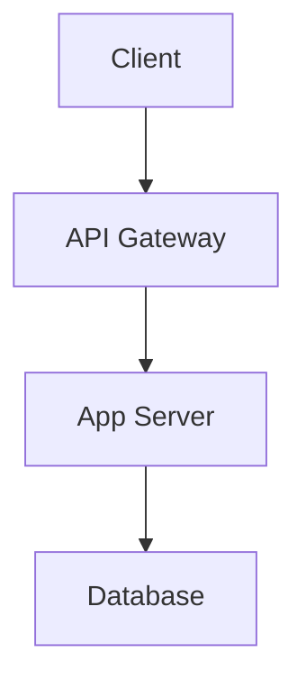
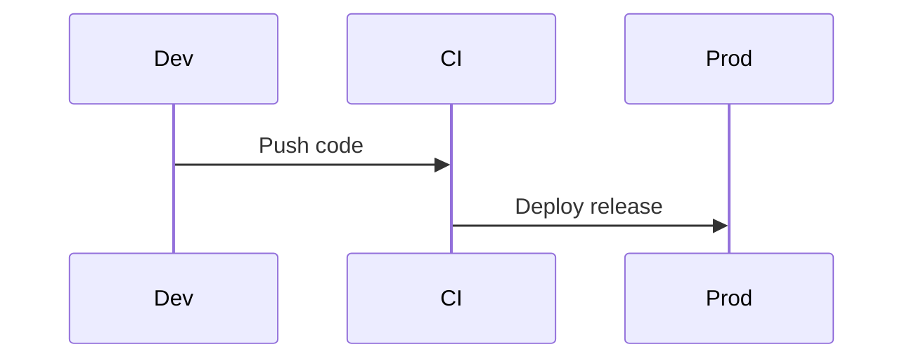

# Exhaustive website prompt: md-mermaid-pdf marketing + demo

**Purpose:** Single source of truth for building the public marketing site and live demo (e.g. Vercel v0, Cursor, or human designers). This document is **not** the old “v0 product version” scope—it is **complete** relative to the **md-mermaid-pdf** product (library, CLI, ecosystem).

**Repositories:** This file lives in **`md-mermaid-pdf-site`** (this Vite app). The npm package and library source live in [**md-mermaid-pdf**](https://github.com/Ali-Karaki/md-mermaid-pdf) — Markdown → PDF with Mermaid diagrams rendered (not left as fenced code). Built on [md-to-pdf](https://github.com/simonhaenisch/md-to-pdf) (Marked + Puppeteer).

**Hard requirements for generated UI copy:** Never claim “full PDF export with zero install” for a **static** deploy. In-browser **preview** of Mermaid needs no install; **real PDF** requires Node + Chromium (CLI, programmatic API, or optional local site PDF API via `npm run dev:api` in this repo).

---

## 1. Product identity

| Field | Value |
|--------|--------|
| **Name** | md-mermaid-pdf |
| **Primary tagline** | Markdown → PDF with Mermaid that actually renders |
| **Alternate hooks** | Drop-in replacement for md-to-pdf for diagram-heavy docs; stop shipping PDFs where Mermaid is still code |
| **Audience** | Developers, technical writers, docs teams, students, platform engineers |
| **One-line technical truth** | Puppeteer renders HTML; Mermaid runs in a headless browser; output is PDF (or static HTML with `as_html: true`) |

**Canonical links (replace if you fork the repo):**

| Placeholder | Use |
|-------------|-----|
| `{{NPM_PACKAGE}}` | `https://www.npmjs.com/package/md-mermaid-pdf` |
| `{{GITHUB_REPO}}` | `https://github.com/Ali-Karaki/md-mermaid-pdf` |
| `{{README_ANCHOR}}` | `{{GITHUB_REPO}}#readme` |

---

## 2. Honest capability matrix (preview vs PDF)

Use this wording on the site so marketing matches engineering.

| Capability | Static marketing site (no backend) | With Node + Chromium |
|------------|-----------------------------------|----------------------|
| Paste Markdown | Yes | Yes |
| Live Mermaid **preview** in browser | Yes (client-side Mermaid) | Yes |
| Download **real** PDF | No (use mock dialog + CLI instructions, or link) | Yes (CLI, API, optional local site PDF API) |
| “No install” | True **for preview only** | False for real PDF |

---

## 3. Design direction

- **Aesthetic:** Clean, modern, developer-focused; Vercel / Stripe–adjacent (not a generic template).
- **Typography:** Strong hierarchy, comfortable line length, monospace for commands.
- **Layout:** Subtle shadows, rounded cards, generous spacing, fully responsive.
- **Default theme:** Dark mode default; optional light toggle if it fits the stack.
- **Stack (this repo):** React, Vite, **Tailwind**, **shadcn/ui**, **lucide-react**, **framer-motion** (subtle section entrances; avoid heavy animation).
- **Code quality:** Production-style components; split by feature (hero, demo, sections) is fine—one **route/page** is enough.

---

## 4. Site information architecture (complete)

Implement **all** of the following sections. Order may vary slightly but nothing below should be omitted.

### 4.1 Hero

- Product name **md-mermaid-pdf**
- Headline + subheadline (use tagline + one sentence on md-to-pdf compatibility)
- **Primary CTA:** scroll to `#demo` — label e.g. “Try it live”
- **Secondary CTAs:** npm package link, GitHub repo link (use real URLs from package metadata)
- Optional: npm install one-liner `npm install md-mermaid-pdf` or `npx md-mermaid-pdf`

### 4.2 Trust / value strip (adjust claims)

Replace naive “no install” with accurate bullets, for example:

- **Preview in browser** — no install to try Mermaid rendering
- **Real PDFs** — one command with Node + Chromium (`npx md-mermaid-pdf`)
- **Mermaid-first** — diagrams render; not stuck as code blocks like typical md-to-pdf flows
- **Developer-native** — CLI, programmatic API, CI recipes, Docker, VS Code extension

### 4.3 Interactive demo (core)

**Layout**

- **Desktop (lg+):** three columns — Markdown editor | Preview | Settings / export
- **Mobile / tablet:** tabs or stacked layout — at minimum **Markdown** / **Preview** tabs; settings accessible without losing context

**Editor**

- Controlled textarea, monospace, accessible label
- Buttons: **Load example**, **Clear** (clear = empty or minimal placeholder)

**Preview**

- Client-side Mermaid: same fenced ` ```mermaid ` blocks as the library
- Respect **Mermaid theme** from settings (e.g. `neutral`, `dark`, `default`, `forest`, `base`) via `mermaid.initialize({ theme })`

**Settings panel (mirror important API options)**

- **PDF format** (A4 / Letter) — affects real PDF only; show as UI state + pass to optional local PDF API if present
- **Page / document theme** — `light` | `dark` for PDF page background (`documentTheme`); preview pane may approximate with CSS
- **Mermaid theme** — drives preview; document that it maps to `mermaidConfig.theme`
- **Margin** — mock or string presets (`20mm`, etc.); maps to `pdf_options.margin` when generating real PDF
- **Export PDF**
  - **Default (static deploy):** dialog or sheet: real generation runs via `npx md-mermaid-pdf …` + copy button; optional link to GitHub README
  - **Export:** POST `/api/pdf` with `{ markdown, mermaidConfig, documentTheme, pdf_format, margin }` → `application/pdf` blob download. **Vercel:** serverless `api/pdf.js`. **Local dev:** `npm run dev:api` + Vite proxy (no env flag)

**Example Markdown (must be valid — use exact fence)**

Include in “Load example”:

- H1, paragraph, bullet list, fenced **non-mermaid** code block
- **Two** Mermaid diagrams: e.g. `flowchart TD` and `sequenceDiagram`
- Use ` ```mermaid ` with **no** space after backticks (invalid: ` ``` mermaid `)

### 4.4 “Why not md-to-pdf?” (comparison)

Table or cards:

| Aspect | md-to-pdf | md-mermaid-pdf |
|--------|-----------|----------------|
| Mermaid in PDF | Shown as code | Rendered as diagrams |
| Config surface | baseline | Same baseline + Mermaid-specific options |
| Extra setup for diagrams | Manual hacks | Built-in |

### 4.5 How it works (3 steps)

1. Write Markdown with ` ```mermaid ` blocks  
2. Tool builds HTML, loads Mermaid (CDN, bundled, or auto with fallback), runs `mermaid.run()`  
3. Puppeteer prints to PDF  

Mention **smart detection:** if there is no ` ```mermaid ` block, Mermaid script is skipped (faster, less network).

### 4.6 Features (exhaustive list for marketing grid)

Group for scannability; include **all** relevant bullets:

**Core**

- Mermaid diagrams render in PDF  
- Drop-in style API vs md-to-pdf (`mdToPdf`, `pdf_options`, `launch_options`, etc.)  
- Input: `{ path }` or `{ content }`; `dest: ''` returns Buffer  
- `as_html: true` — emit HTML instead of PDF (md-to-pdf-compatible)  

**Mermaid & rendering**

- `mermaidConfig` → `mermaid.initialize()` (theme, flowchart, etc.)  
- `mermaidSource`: `cdn` | `bundled` | `auto`  
- `mermaidCdnUrl` override; CDN preflight with **fallback to bundled** when unreachable  
- `mermaidWaitUntil`, `mermaidRenderTimeoutMs` for CI  
- `failOnMermaidError`, `onMermaidError` with diagram count in errors  
- `mermaidAutofix` — conservative transforms on fenced mermaid bodies  
- `mermaidExportImages` — export diagrams as PNG or SVG alongside PDF  

**Document styling**

- `preset`: `github` | `minimal` | `slides` (landscape, `---` slide breaks)  
- `documentTheme`: `light` | `dark` (page/body styling)  
- `toc: true` — heading-based table of contents  
- `beforeRender` / `afterRender` page hooks  
- `debug: true` — debug HTML file + stderr logging  

**CLI** (`md-mermaid-pdf` and alias `mmdpdf`)

- `input.md` → PDF beside file; `input.md output.pdf`  
- Multiple inputs → batch (one PDF per file)  
- `--concat a.md b.md -o book.pdf` — single PDF via `mdToPdfFromFiles`  
- Glob patterns, e.g. `"docs/**/*.md"` (`.md` only expansion)  
- `-o -` / `--output -` — PDF to stdout  
- `--watch` — single-file rebuild on save  
- `--slides` — slides preset  
- `--theme <name>` — Mermaid theme  
- `--document-theme light|dark`  
- `--mermaid-source cdn|bundled|auto`  
- `-h` / `--help`  

**Programmatic API exports**

- `mdToPdf` — main  
- `mdToPdfAuto(path)` — basedir, dest beside input, `mermaidSource: 'auto'`  
- `mdToPdfFromFiles(paths, config, { separator })`  
- `mdToPdfBatch(paths, config, { concurrency, incremental, cacheDir })`  
- `DEFAULT_MERMAID_CDN_URL`  
- `createMermaidMarkedRenderer`  
- `convertMdToPdfMermaid`, `generateOutputMermaid` (advanced)  

**Config / docs**

- YAML front matter merged into config; nested `md_mermaid_pdf:` to avoid colliding with other YAML  
- `outputCache` — skip conversion when input + selected config unchanged  
- `hashOutput` — `.sha256` sidecar (or stderr hash in stdout mode)  

**Ecosystem**

- **Docker** — README describes `docker build` / `docker run`  
- **GitHub Action** — composite action under `action/`  
- **VS Code extension** — `packages/vscode-md-mermaid-pdf`  
- **Integration recipes** — `docs/recipes.md`: Express, Next.js, NestJS, GitHub Action patterns  
- **Examples** — `examples/sample.md`, `examples/docs/`, `examples/slides/`, `examples/report/`  
- **Marketing site** — this repo (`md-mermaid-pdf-site`); optional local PDF API (see §10)  
- **Multi-file book** — `mdToPdfFromFiles` / CLI `--concat`: only the **first** file’s YAML front matter applies; put shared `pdf_options` / `mermaidConfig` in file 1 ([docs/compose.md in md-mermaid-pdf](https://github.com/Ali-Karaki/md-mermaid-pdf/blob/main/docs/compose.md))  

**Requirements**

- Node ≥ 20.16, npm ≥ 10.8 (engines)  
- CommonJS package; ESM via interop  

### 4.7 Power user / “CLI cheat sheet”

Short code block section:

```bash
npx md-mermaid-pdf doc.md
npx md-mermaid-pdf doc.md out.pdf
npx md-mermaid-pdf "docs/**/*.md"
npx md-mermaid-pdf --concat part1.md part2.md -o book.pdf
npx md-mermaid-pdf doc.md -o - > out.pdf
npx md-mermaid-pdf slides.md --slides
npx mmdpdf doc.md   # alias
```

**Windows:** Quote glob patterns so the shell does not expand them early, e.g. `npx md-mermaid-pdf "docs\**\*.md"` or `"docs/**/*.md"`.

Link to full README for programmatic options.

### 4.8 Footer

- npm, GitHub, License **MIT**  
- Links: **Issues**, **Changelog** (`CHANGELOG.md` on GitHub), **Recipes** (`docs/recipes.md`), optional **Contributing** / **Security** if present in repo  

---

## 5. SEO & discoverability (content requirements)

Work these phrases into headings or body copy where natural:

- mermaid not rendering in pdf  
- markdown to pdf mermaid  
- md-to-pdf mermaid  

Package keywords already include: `mermaid-diagrams`, `markdown-to-pdf`, `docs-generator`, `diagram-rendering`, `md-to-pdf`, `puppeteer`.

**Social / meta (set per deploy):**

- `<title>` — e.g. `md-mermaid-pdf — Markdown to PDF with Mermaid`  
- `<meta name="description">` — one sentence + “CLI & Node; preview in browser”  
- Open Graph: `og:title`, `og:description`, `og:url`, optional `og:image` (1200×630 or repo screenshot)  
- Twitter card: `summary_large_image` if you have art; else `summary`  

---

## 6. Accessibility & UX

- Visible focus states, sufficient contrast in dark mode  
- Labels for all demo controls  
- Dialog/sheet for export: keyboard dismiss, clear primary action  
- Don’t block preview on failed optional PDF API—show error inline  
- Skip link (“Skip to demo”) to `#demo`  
- Respect `prefers-reduced-motion`: disable or shorten framer-motion when set  

---

## 7. Out of scope for the marketing site (do not promise in UI)

- Plugin systems, custom fence handlers, AST middleware, ebook generator, queue integrations  
- Hosted multi-tenant “PDF as a service” unless you actually ship it  
- Perfect byte-identical PDFs across OS/Chrome versions (link to determinism note in docs if mentioned)  

---

## 8. Maintenance

When the library gains features, update **§4.6** and **§4.8** in this file first, then refresh the site. This document should remain the **exhaustive** prompt/spec for the public face of the product.

---

## 9. Fine print (caching, hashes, CI)

- **PDF bytes** are not guaranteed identical across Chrome/OS runs ([docs/determinism.md in md-mermaid-pdf](https://github.com/Ali-Karaki/md-mermaid-pdf/blob/main/docs/determinism.md)). `hashOutput` is for same-environment checks, not global reproducibility.  
- **`mdToPdfBatch` + `incremental: true`:** cache key is **markdown file content only**. Changing `preset`, margins, or `mermaidConfig` without changing the `.md` text can leave stale PDFs—bump cache or delete `cacheDir/batch-hash.json`.  
- **`outputCache`:** keyed by a **subset** of config (`preset`, `toc`, `documentTheme`, `mermaidConfig`) plus normalized markdown; other options may not bust the cache—document or widen the key in code when you change behavior.  
- **Headless Linux / CI:** minimal images may need `libgbm1`, `libnss3`, etc.; link [Puppeteer troubleshooting](https://pptr.dev/guides/configuration#chrome-does-not-launch-on-linux).  
- **Maintainers (not hero copy):** `npm run capture-readme-assets` builds `examples/sample.pdf` and, if [Poppler](https://poppler.freedesktop.org/) `pdftoppm` is installed, a PNG for README assets.  

---

## 10. Site local PDF API (exact dev flow)

For **real** PDF download from the Vite app (optional, not static hosting):

1. Terminal A — from **repository root** of `md-mermaid-pdf-site`: `npm run dev:api` (default **port 3001**).  
2. Terminal B — `npm run dev` (Vite proxies `/api` → `localhost:3001`).  
3. UI: POST `/api/pdf` with JSON body `{ markdown, mermaidConfig?, documentTheme?, pdf_format?, margin? }`; response `application/pdf`.  
4. Env override: **`PDF_API_PORT`** if 3001 is taken.  

Static deploy (e.g. Vercel static): omit API; use export dialog with CLI instructions only.

---

## 11. Canonical example Markdown (paste into “Load example”)

````markdown
# Project Architecture

This document shows a simple service flow and a release sequence.

- Renders **Mermaid** in the preview
- Same fenced blocks work with the CLI for PDF

## Stack

```text
Markdown → HTML → Mermaid.run() → Puppeteer → PDF
```

## Service flow



## Release flow


````

---

## 12. Optional site extras (not required)

- Analytics (Plausible, Fathom, GA) — privacy policy link if cookies/PII  
- `robots.txt` + `sitemap.xml` for public deploy  
- Version badge from npm or “Latest release” link  
- Blog / Dev.to — out of scope for generated UI; link from footer if you publish  

---

*End of exhaustive website prompt.*
